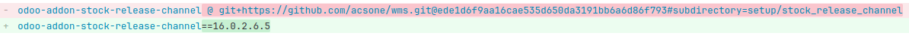

# pip-wheel-diff

[](https://pypi.org/project/pip-wheel-diff)
[](https://pypi.org/project/pip-wheel-diff)

-----

**Table of Contents**

- [Installation](#installation)
- [License](#license)

## Installation

```console
pipx install pip-wheel-diff
```

## Usage

Imagine you have to review a pull request with a diff like this in `requirements.txt`.



How do you verify the change is what you expect?

To answer this question, you can run `pip-wheel-diff` with two pip requirements as
arguments. It will download or build the wheels, unzip them, clean them up a little bit
for comparability and run a diff tool to compare them.

Example:

```console
pip-wheel-diff \
  "odoo-addon-stock-release-channel @ git+https://github.com/acsone/wms.git@ede1d6f9aa16cae535d650da3191bb6a6d86f793#subdirectory=setup/stock_release_channel" \
  "odoo-addon-stock-release-channel==16.0.2.6.5"
```

It tries to find a diff tool in the following order:
- `meld`
- `diff -r`

## License

`pip-wheel-diff` is distributed under the terms of the [MIT](https://spdx.org/licenses/MIT.html) license.
